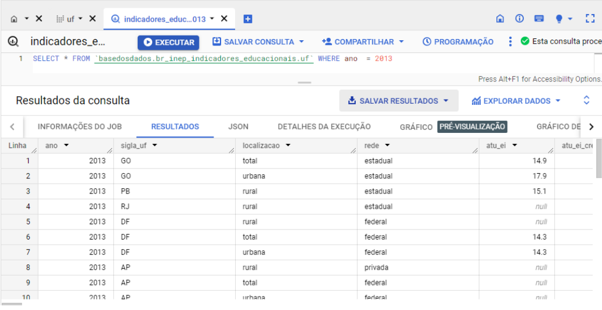
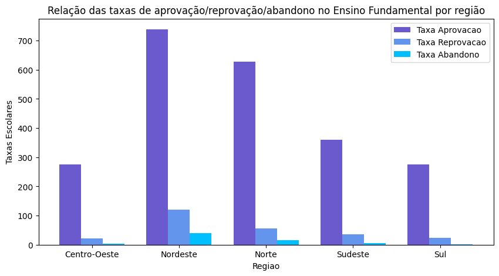
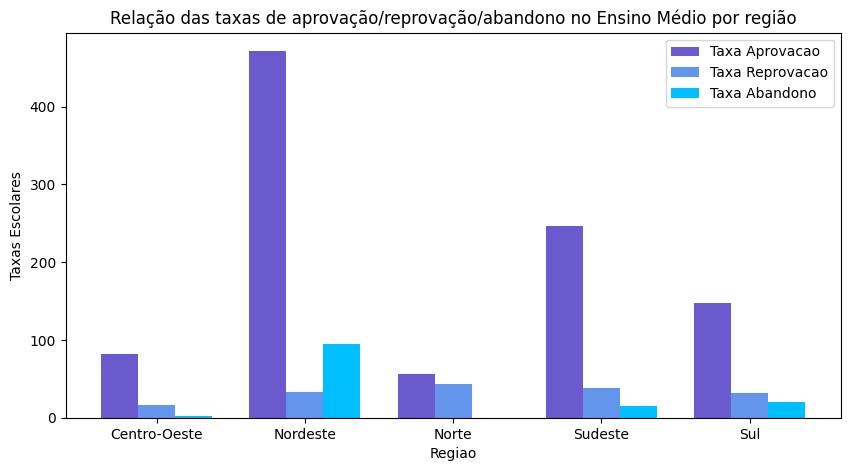
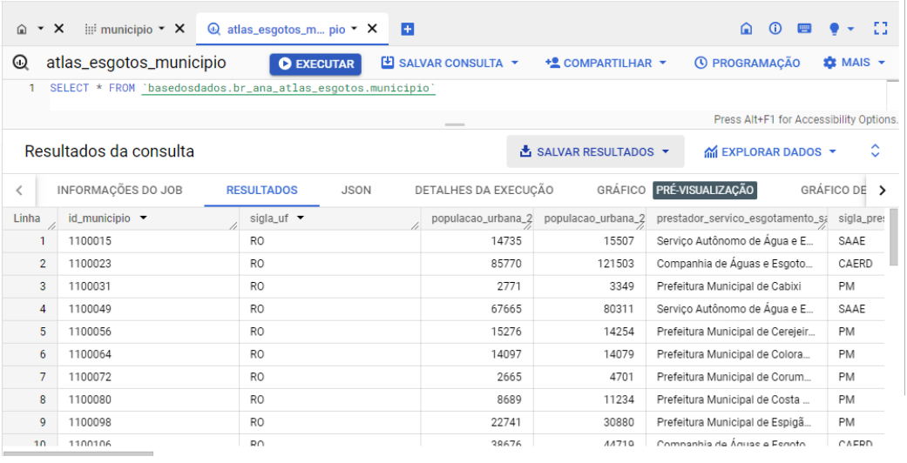
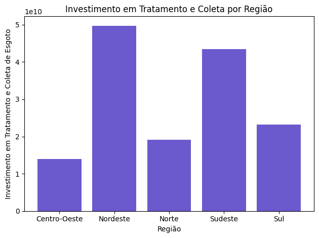

# 📊 Relação entre Investimentos em Saneamento e Taxas Escolares no Brasil (2013)

Este projeto tem como objetivo analisar se existe — e como se dá — a relação entre os **investimentos em coleta e tratamento de esgoto** e as **taxas escolares** nas diferentes 
regiões do Brasil, no ano de **2013**.

A hipótese é de que melhores condições de saneamento impactam positivamente a frequência e o desempenho escolar.


---
### 🔧 Etapas da Análise

A análise foi organizada em quatro principais etapas:

1. Organização e preparação dos dados  
2. Análise exploratória dos dados  
3. Visualização dos dados através de gráficos
4. Discussão final dos resultados

---

### 🗃️ Bases de Dados Utilizadas

Foram utilizadas as seguintes bases de dados retiradas do repositório Base dos Dados[^1]:

- 💧 **Atlas Esgoto**[^2]
  
  Informações sobre a gestão dos recursos hídricos a nível municipal.

- 🎓 **Indicadores Educacionais**[^3]
  
  Indicadores educacionais agregados por Unidade da Federação (UF).

---

### 🎓 Indicadores Educacionais
Como a análise é voltada para o ano de 2013, filtrei os dados dos indicadores educacionais exclusivamente para esse ano, 
utilizando uma consulta SQL no Google BigQuery. O resultado foi então salvo para uso posterior na análise.



Como a tabela original continha diversas colunas irrelevantes para os objetivos da análise, foi realizada uma seleção apenas das colunas de interesse. 
Além disso, aplicou-se um filtro para considerar exclusivamente escolas localizadas em áreas urbanas e da rede estadual.

```
colunas_desejadas = ['sigla_uf','localizacao','rede','taxa_aprovacao_ef', 'taxa_aprovacao_em', 'taxa_reprovacao_ef',
                     'taxa_reprovacao_em', 'taxa_abandono_ef', 'taxa_abandono_em']

df = df.loc[df['localizacao'] == 'urbana']

df = df.loc[df['rede'] == 'municipal']

df.loc[:, colunas_desejadas]
```

Uma nova coluna chamada **região** foi adicionada à tabela para identificar a qual região do Brasil cada linha se refere.

```
uf_para_regiao = {
    "AC": "Norte",
    "AL": "Nordeste",
    "AM": "Norte",
    "AP": "Norte",
    "BA": "Nordeste",
    "CE": "Nordeste",
    "DF": "Centro-Oeste",
    "ES": "Sudeste",
    "GO": "Centro-Oeste",
    "MA": "Nordeste",
    "MG": "Sudeste",
    "MS": "Centro-Oeste",
    "MT": "Centro-Oeste",
    "PA": "Norte",
    "PB": "Nordeste",
    "PE": "Nordeste",
    "PI": "Nordeste",
    "PR": "Sul",
    "RJ": "Sudeste",
    "RN": "Nordeste",
    "RO": "Norte",
    "RR": "Norte",
    "RS": "Sul",
    "SC": "Sul",
    "SE": "Nordeste",
    "SP": "Sudeste",
    "TO": "Norte"
}


df["regiao"] = df["sigla_uf"].map(uf_para_regiao)
```

Os dados sobre as taxas de aprovação no Ensino Fundamental, que anteriormente estavam organizados por Unidade da Federação (UF), foram agora agrupados por região.
Foi criado uma gráfico de barras verticais para uma melhor visualização dos resultados utilizando **Matplotlib**.

O mesmo procedimento foi feito para as taxas de **reprovação** e **abandono** do Ensino Fundamental.

Para uma melhor comparação dos dados, foi criado um gráfico de barras agrupadas.



Dessa forma, é fácil perceber que a região Nordeste é a região que possui maior taxa de aprovação, seguida das regiões Norte, Sudeste, Centro-Oeste e Sul.

Também é a região Nordeste que possui maior taxa de reprovação, seguida da região Norte, Sudeste e Centro-Oeste e Sul.

Por fim, o Nordeste também apresenta a maior taxa de abandono, seguida por Norte, Sudeste, Centro-Oeste e região Sul.

&nbsp;

De forma similar, as mesmas etapas descritas acima foram feitas para o Ensino Médio.
Ao final, para uma melhor comparação dos dados, foi criado um gráfico de barras agrupadas.



Sendo assim, percebe-se que a região Nordeste é a região que possui maior taxa de aprovação, seguida das regiões Sudeste, Sul, Centro-Oeste e Norte.

É a região Norte que possui maior taxa de reprovação, seguida das regiões Sudeste, Sul e Nordeste, e por último Centro-Oeste.

E por fim, a região Sul é a região com maior índice de abandono, seguida da região Sudeste, Centro-Oeste, Norte e Nordeste.

---
### 💧 Atlas Esgoto
Como os dados disponíveis referentes à coleta e tratamento de esgoto eram todos referentes ao ano de 2013, não se fez necessário
restringir os resultados através de uma consulta SQL, como feito anteriormente.

[foto consulta SQL 2]


Da mesma forma, como a tabela original continha diversas colunas irrelevantes para os objetivos da análise, foi realizada uma seleção apenas das colunas de interesse.

Uma nova coluna chamada **região** também foi adicionada à tabela para identificar a qual região do Brasil cada linha se refere.

```
colunas_desejadas = ['id_municipio', 'sigla_uf', 'investimento_coleta',
                    'investimento_coleta_tratatamento', 'investimento_tratamento']

df_investimento = df_investimento.loc[:, colunas_desejadas]

df_investimento["regiao"] = df_investimento["sigla_uf"].map(uf_para_regiao)
```

Para uma melhor visualização dos dados, foi criada um gráfico de barras verticais para os dados de **Investimento em Coleta de Esgoto por Região** e 
**Investimento em Tratamento de Esgoto por Região**.
Esses resultados foram sintetizados em um único gráfico.



---
### 📄Discussão Final
Olhando os resultados, percebe-se que a região Nordeste é a região que possui mais investimentos em tratamento e coleta de esgoto, seguida da região Sudeste. Em seguida,
temos a região Sul, Norte e por fim a região Centro-Oeste com a menor taxa de investimento e coleta de esgoto.

Ao comparar os resultados dos indicadores educacionais do Ensino Fundamental com os investimentos em tratamento e coleta de esgoto, 
observa-se que a região Centro-Oeste, que apresenta a menor taxa de investimento, também possui uma baixa taxa de reprovação e abandono. 
Por outro lado, o Nordeste, que lidera os investimentos, tem a maior taxa de aprovação no Ensino Fundamental, mas também enfrenta as maiores taxas de reprovação e abandono. 
Esse padrão também se repete nos indicadores educacionais do Ensino Médio.

O esperado, com base na hipótese de que melhores condições de saneamento impactam positivamente a frequência e o desempenho escolar, seria que o Nordeste, 
por ser a região com maior investimento em saneamento, apresentasse também a maior taxa de aprovação e as menores taxas de reprovação e abandono escolar. 
No entanto, os resultados não confirmam essa expectativa. Vale ressaltar que a análise realizada até aqui é limitada, e fatores externos podem influenciar os resultados observados. 
Além disso, uma análise temporal mais aprofundada poderia fornecer insights mais precisos sobre a relação entre os investimentos em saneamento e os índices educacionais.
Assim, a análise apresentada serve como um ponto de partida para investigações mais detalhadas.


  [^1]: https://basedosdados.org
  [^2]: https://basedosdados.org/dataset/fdd3e0b6-a5bd-4cb6-83c9-eae7cb5cdccb?table=7f12e752-d9db-4dd2-9ced-4650561d72d4
  [^3]: https://basedosdados.org/dataset/63f1218f-c446-4835-b746-f109a338e3a1?table=95f49a8d-fb99-416c-ab92-10bcb523b3a3
